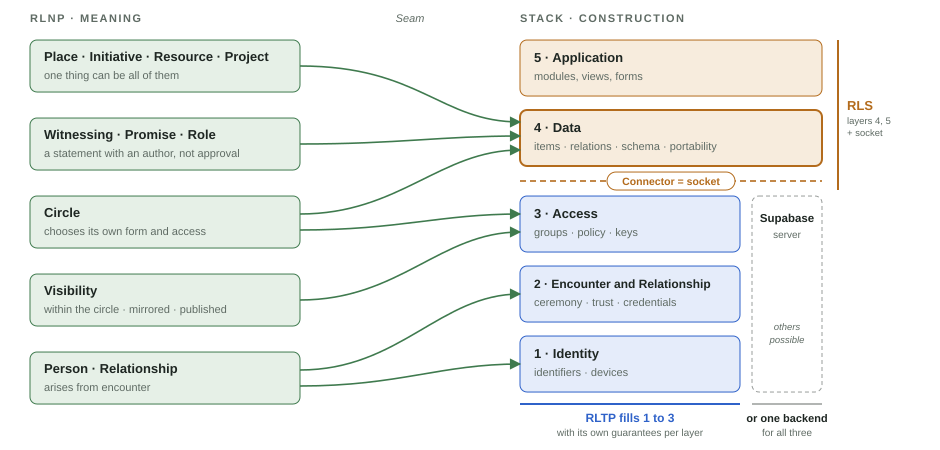

# Real Life · meta

What belongs to none of the three parts alone: the layer picture, the seams between the parts, the shared term register, the roadmaps, and team coordination.

## The three parts

Real Life consists of three parts. Two are specifications, one is code.

- The **Real Life Network Protocol (RLNP)** is the social specification. It defines what a circle, an encounter, a promise and a role are, and which norms apply to them. It does not define formats, signatures or keys.
- The **Real Life Stack (RLS)** is the code: an app toolkit with an **application** layer (modules, views, forms), a **data** layer (items, relations, schema, portability) and a **connector** below them, the socket at which a backend docks. The stack ends at the socket. What a backend provides is declared through capabilities; the data layer assumes nothing beyond them.
- The **Real Life Trust Protocol (RLTP)** is the technical specification for the three layers below the socket: **identity** (identifiers, devices, recovery), **encounter and relationship** (ceremony, trust, credentials) and **access** (groups, policy, keys, epochs). It is the backend that satisfies RLNP's requirements on a statement: portable, signed, independently verifiable. A conventional backend such as Supabase fills the same socket with fewer guarantees; communities that prefer a server use it.

RLNP and RLTP are both normative and neither sits above the other: RLNP decides what a thing means, RLTP decides how it is constructed. Where both use the same word, RLNP wins for the meaning and RLTP for the construction.

Every green edge in the picture is a **seam**: a word from RLNP with a counterpart in the stack. Where no edge leads, there is deliberately no counterpart. The seams are listed in [overview/seams.md](overview/seams.md); what each cell answers, and what it never answers, in [overview/cells.md](overview/cells.md).

## Entry points

| Site | For whom | What it does |
|---|---|---|
| [reallife.network](https://reallife.network) | everyone who wants to connect | invites you into relationship, in RLNP's language |
| trust-protocol.real-life.org (today [rltp.real-life.org](https://rltp.real-life.org)) | protocol developers, DTGWG, security people | specification, simulators, conformance |
| [real-life-stack.de](https://real-life-stack.de) | developers, vibecoders, agents | handbook, term atlas, how to build and contribute |

Each door shows the same picture from its own side.

## What lives here

| Path | Content |
|---|---|
| `overview/` | the layer picture (`layers.svg`, bilingual), the cells, the seams |
| `terms/` | the federated term register: shared context, mappings between the three concept schemes, sources, and seed copies until each world carries its own file |
| `scripts/` | `guard.py` checks the register (runs in every repo's CI); `render.py` produces one view per door |
| `views/` | generated views of the register, one per door; consumed by the sites at build time |
| `roadmap/` | one roadmap per door and the shared rules |
| `coordination/` | who works on what, and a daily log; the one place where everyone writes in their own language |

## The ground rule

**Definitions never live here.** Each world defines its own terms in its own repository and stays normative for them. This repository holds only what connects them: the picture, the seams, the mappings, the checks.

Identifiers are served from `real-life.org`: `rlnp/v1`, `rltp/v1`, `rls/v1`, `meta/v1`. They follow the protocols, not the branding; a breaking change gets a new version, not a new word.

## License

[CC BY 4.0](LICENSE), like the two specification repositories.
